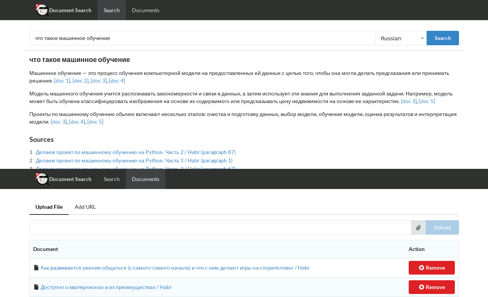

# Document Search

Simple implementation of local semantic search based on
[ChromaDB](https://docs.trychroma.com/) and [Ollama](https://ollama.com/).



## Installation

This project use [Ollama](https://ollama.com/). So you must install it before
using search or shortening.

```bash
python -m venv venv # create virtual environment, if needed
source venv/bin/activate # activate virtual environment, if needed
python -m pip install -r requirements.txt
```

## Usage

Convert YouTube subtitles to plain text:

```bash
python main.py # Start server on http://127.0.0.1:5000

```

## License

Source code is primarily distributed under the terms of the MIT license. See LICENSE for details.
